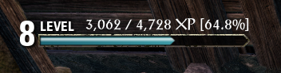
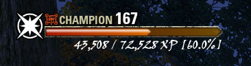
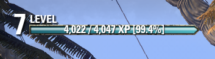
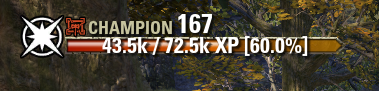

#  PantherXP 
 

An Add-On for Elder Scrolls Online

## Features
- A simple Add-On that allows for the XP Bar to be displayed at all times.
- Setting saves Account-wide across all characters.
- Customizable XP Label overlay
    - Font face
    - Font size
    - XP Label formatting

**PantherXP** references [Slightly Improved™ Experience Bar](https://www.esoui.com/downloads/info73-SlightlyImprovedExperienceBar.html) by [L8Knight](https://www.esoui.com/forums/member.php?action=getinfo&userid=1084). 
This Add-On as not been updated recently which motivated me to create my very first game Add-On!

## Developer
- Rynzaii

## Preview Examples

Player Progress XP            |  Champion XP
:-------------------------:|:-------------------------:
  |  
  |  

## Download from ESOUI
PantherXP has been uploaded on to [ESOUI](https://www.esoui.com/downloads/info3404-PantherXP.html)

## Contribution
PantherXP is open source released under the MIT License.
Feel free to suggest or make any contributions!

## Disclaimer

> This Add-on is not created by, affiliated with or sponsored by ZeniMax Media Inc. or its affiliates. The Elder Scrolls® and related logos are registered trademarks or trademarks of ZeniMax Media Inc. in the United States and/or other countries. All rights reserved.